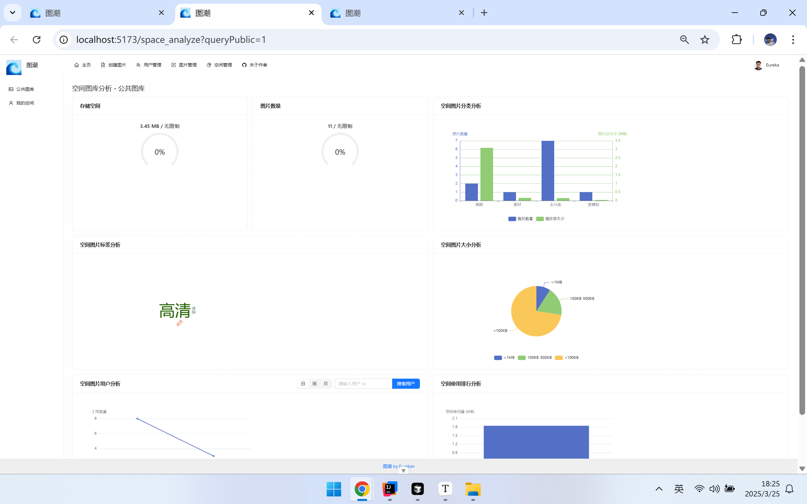

# 图潮

## 项目介绍

基于 Vue 3 + Spring Boot + COS 的 **AI 云图库平台**

核心功能可分为 3 大类

1）所有用户都可以在平台公开上传和检索图片素材，快速找到需要的图片。可用作表情包网站、设计素材网站、壁纸网站等：

2）管理员可以上传、审核和管理图片，并对系统内的图片进行分析：

3）对于个人用户，可将图片上传至私有空间进行批量管理、检索、编辑和分析，用作个人网盘、个人相册、作品集等：

## 项目亮点

### 图片编辑

### 图片分享

### 图库分析

### 以图搜图

### 颜色识图

### AI 扩图

## 技术选型

* Vue 3 框架
* Vite 打包工具
* Ant Design Vue 组件库
* Axios 请求库
* Pinia 全局状态管理
* 其他组件：数据可视化、图片编辑等
* ⭐️ 前端工程化：ESLint + Prettier + TypeScript
* ⭐️ OpenAPI 前端代码生成